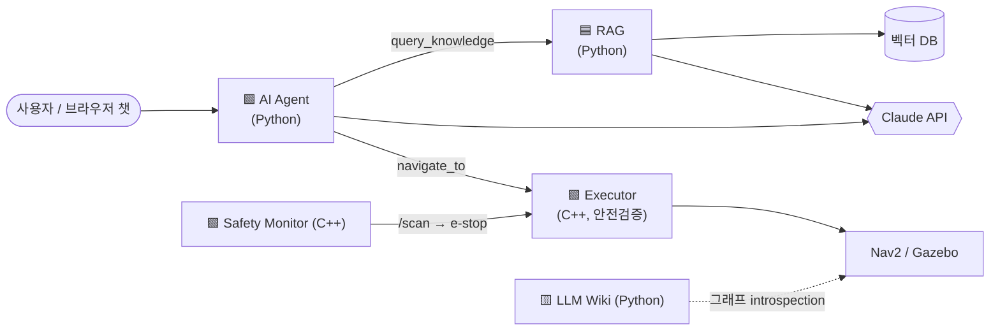

# ROS2 Copilot 🤖🧠

[](https://github.com/bong7233/Ros_Copilot/actions/workflows/ci.yml)
[](LICENSE)

> ROS2 로봇을 위한 **LLM 에이전트 & 지식 어시스턴트** — RAG · AI Agent · LLM Wiki를 실제 로봇 시스템에 결합한 프로젝트

**로봇공학 C++·Python 개발자**로서의 실력과, **요즘 가장 뜨거운 AI 스택(RAG / AI Agent / LLM Wiki)** 을 한 프로젝트 안에서 동시에 증명하는 것을 목표로 합니다. 뻔한 "ChatGPT 래퍼"도, 뻔한 ROS2 튜토리얼도 아닌 **둘의 교집합** — 지금 로봇 업계에서 제일 뜨거운 프론티어(LLM × Robotics, embodied agent)를 직접 만들어 봅니다.

---

## 이게 뭔가요?

Gazebo 시뮬레이션 위에서 돌아가는 ROS2 모바일 로봇을 두고, **자연어로 질문하고 · 명령하고 · 문서화**하는 시스템입니다.

```
"costmap inflation을 키웠더니 로봇이 좁은 문을 못 지나가는데 왜 그래?"   → 🟦 RAG 지식 어시스턴트가 출처 인용과 함께 답변
"창고 구역으로 이동한 뒤 상태 보고해"                                   → 🟩 AI Agent가 계획하고 Nav2로 실행
"이 로봇 시스템 문서 만들어줘"                                          → 🟨 LLM Wiki가 노드 그래프를 자동 문서화
```

## 시스템 한눈에 보기



## 3-레이어 아키텍처

| 레이어 | 역할 | 배우는 AI 기술 | 배우는 로봇/개발 기술 | 언어 |
|---|---|---|---|---|
| 🟦 **Layer 1 — RAG 지식 어시스턴트** | 문서/코드 기반 근거 있는 Q&A | 청킹·임베딩·벡터검색·리랭킹·citation | rclpy, ROS2 파라미터/서비스 | Python |
| 🟩 **Layer 2 — AI Agent** | 자연어 → 계획 → 로봇 제어 | tool calling, ReAct 에이전트 루프 | rclcpp, ROS2 actions, tf2, QoS | **C++ + Python** |
| 🟨 **Layer 3 — LLM Wiki** | ROS2 그래프 자동 문서화 | structured generation, grounding | ROS2 introspection API | Python |

## 왜 이 프로젝트인가 (채용 관점)

- **C++(rclcpp) + Python(rclpy) 둘 다** 실전 코드 → 로봇 개발자 직무 요건 정확히 충족
- **돌아가는 로봇**(Gazebo + Nav2) 데모 → 포트폴리오 임팩트
- **LLM × 로봇** 프론티어 주제 → 트렌드를 아는 개발자 시그널
- 멀티패키지 colcon 워크스페이스 + 커스텀 인터페이스 → **시스템 설계** 역량

## 문서

- ⚡ [**윈도우 11 빠른 실행**](docs/QUICKSTART_WINDOWS.md) — 지금 윈도우 데스크톱에서 5단계로 웹 챗 띄우기 (가장 짧음)
- 🚀 [**실행 가이드 (HOW_TO_RUN)**](docs/HOW_TO_RUN.md) — **프로그래밍 몰라도** 따라 하는 전체 실행법 (Windows 11 · Docker · WSL2 · 리눅스). 면접 데모용으로도 이 문서를 그대로 쓰세요.
- 🧭 [**GuideForBong**](docs/GuideForBong.md) — *이 프로젝트가 정말 RAG/Agent/Wiki를 쓰나? 내가 뭘 배우나?* 에 대한 자세한 답
- 🖥️ [**실행 환경 가이드**](docs/ENVIRONMENT.md) — 윈도우/리눅스/Docker에서 어떻게 돌리나, 실행 형태(분산 시스템 vs 웹앱)
- 🛰️ [**개발 서버 세팅**](docs/DEV_SERVER_SETUP.md) — 집 고성능 데스크톱을 리눅스 개발 서버로, 노트북에서 원격 접속 (Tailscale · VS Code Remote-SSH · Moonlight)
- 📐 [**아키텍처**](docs/ARCHITECTURE.md) — 노드 설계, C++/Python 분리, 데이터 흐름, 워크스페이스 구조
- 🗺️ [**로드맵**](docs/ROADMAP.md) — Phase 0~5 단계별 빌드 & 학습 계획, "완료 기준"
- 📚 [**학습 가이드**](docs/LEARNING_GUIDE.md) — RAG / Agent / LLM Wiki / ROS2 각각을 어떻게 익힐지 + 추천 자료

## 기술 스택

- **로봇**: ROS2 (Humble/Jazzy), Nav2, Gazebo, tf2, colcon
- **언어**: C++17 (rclcpp), Python 3.10+ (rclpy)
- **LLM**: [Claude API](https://docs.claude.com) (Opus / Sonnet)
- **RAG**: 임베딩 + 벡터DB (pgvector 또는 Chroma)

## 시작하기

### ⚡ 빠른 체험 (Docker, 웹 챗 — 프로그래밍 몰라도 OK)

```bash
docker build -f docker/Dockerfile -t robo-copilot .
docker run -it --rm -p 8000:8000 -e ANTHROPIC_API_KEY="sk-ant-..." \
  robo-copilot bash /app/docker/web-demo.sh
# → 브라우저에서 http://localhost:8000
```

자세한 단계별 안내(Windows 11 · WSL2 · 리눅스 포함)는
[**실행 가이드**](docs/HOW_TO_RUN.md)를 보세요.

### 워크스페이스 구조

**Phase 0 스캐폴딩이 이미 들어있습니다.** [`ros2_copilot_ws/`](ros2_copilot_ws/)에 colcon 워크스페이스가 있어요:
- `copilot_msgs` — C++/Python 양쪽에서 쓰는 커스텀 인터페이스
- `copilot_py_demo` (rclpy) ⇄ `copilot_cpp_demo` (rclcpp) — 커스텀 메시지로 통신하는 데모
- `tools/llm_smoketest.py` — Claude API 첫 호출 확인

빌드·실행 방법은 [`ros2_copilot_ws/README.md`](ros2_copilot_ws/README.md)를 보세요.

**전체 구성 (Phase 0–6 구현됨):**
- `ros2_copilot_ws/` — ROS2 워크스페이스 (RAG·Agent·Executor·Wiki·Bringup)
- [`eval/`](eval/) — 평가 harness (RAG 정확도·안전 위반 0 검증) · Phase 5
- [`web/`](web/) — 챗 웹 프론트엔드 (에이전트와 브라우저로 대화) · Phase 6
- [`docker/`](docker/) — 어느 OS에서든 실행 가능한 컨테이너 환경

## 라이선스

[MIT](LICENSE)
