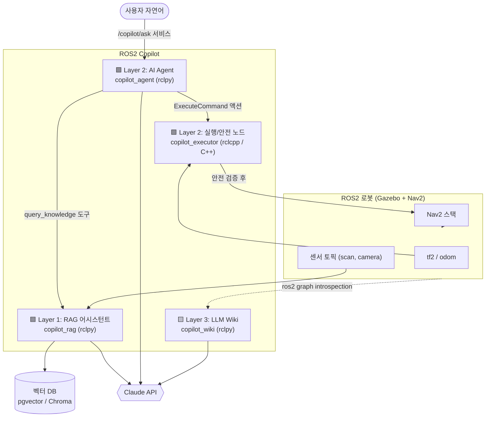

# 아키텍처 (ARCHITECTURE)

ROS2 Copilot의 시스템 설계 문서입니다. **무엇을, 왜, 어떤 언어로** 만드는지를 정의합니다.

---

## 1. 설계 원칙

1. **각 AI 기술 = 하나의 ROS2 레이어(패키지)** — RAG, Agent, Wiki가 서로 독립적으로 개발·테스트 가능
2. **언어 분리는 "역할"로 결정** — 실시간/안전/성능이 중요한 곳은 **C++(rclcpp)**, AI 오케스트레이션/글루 코드는 **Python(rclpy)**. 억지로 나누지 않고 ROS2 개발자가 실제로 판단하는 기준을 따른다
3. **표준 ROS2 인터페이스로 통신** — 레이어 간에도 topic/service/action을 쓴다. (파이썬 함수 호출로 때우지 않음 → 진짜 분산 시스템 설계 연습)
4. **LLM은 도구를 쓰는 두뇌, 로봇은 실행체** — LLM이 직접 모터를 돌리지 않는다. LLM → 검증된 도구/액션 → ROS2. 안전 계층이 항상 사이에 있다

---

## 2. 전체 데이터 흐름



**핵심 흐름 한 줄 요약:** 사용자 질문 → Agent가 판단 → (지식이 필요하면 RAG 호출 / 행동이 필요하면 Executor에 액션 전송) → Executor가 안전 검증 후 Nav2 실행 → 결과를 자연어로 회신.

---

## 3. 레이어별 상세

### 🟦 Layer 1 — RAG 지식 어시스턴트 (`copilot_rag`, Python/rclpy)

문서·코드에 근거한 Q&A를 담당. **로봇 없이도 단독 개발 가능** → 여기서부터 시작한다(Phase 1).

- **인덱싱 대상**: ROS2/Nav2 공식 문서, 로봇공학 레퍼런스, **이 워크스페이스의 소스/URDF/YAML 설정**
- **파이프라인**: 문서 로드 → 청킹 → 임베딩 → 벡터DB 저장 → (질의 시) 검색 → 리랭킹 → 프롬프트 조립 → LLM 답변 + 출처
- **ROS2 인터페이스**:
  - Service `~/query` (`copilot_msgs/srv/Query`): `string question → string answer, string[] sources`
- **왜 Python**: LLM/임베딩 생태계(SDK, 벡터DB 클라이언트)가 파이썬 중심. rclpy로 서비스 서버 구현 연습.

### 🟩 Layer 2 — AI Agent (`copilot_agent` Python + `copilot_executor` C++)

자연어 명령을 **계획**하고 **실행**한다. 이 레이어가 C++/Python 균형의 핵심이다.

**`copilot_agent` (Python/rclpy) — "두뇌"**
- Claude의 tool calling으로 도구 선택·다단계 추론(ReAct 루프)
- 도구 목록(=Agent가 쓸 수 있는 능력):
  | 도구 | 하는 일 | 내부 구현 |
  |---|---|---|
  | `query_knowledge(q)` | RAG에 질문 | Layer 1 서비스 호출 |
  | `get_robot_state()` | 현재 위치/속도 | tf2 + `/odom` 구독 |
  | `list_topics()` / `node_info(n)` | 그래프 introspection | rclpy graph API |
  | `navigate_to(x, y, θ)` | 목표 지점 이동 | **Executor에 액션 전송** |
  | `cancel_task()` | 진행 중 작업 취소 | 액션 cancel |
- Service `~/ask` (`copilot_msgs/srv/Ask`): 사용자 진입점

**`copilot_executor` (C++/rclcpp) — "손발 + 안전"**
- **실시간/안전 중요 → C++로 작성** (rclcpp, 로봇 개발자 핵심 역량 증명 지점)
- Action Server `ExecuteCommand` (`copilot_msgs/action/ExecuteCommand`): Agent가 보낸 고수준 명령을 받아
  1. **안전 검증**: 목표가 맵 범위 내인가, 속도 한계, e-stop 상태
  2. Nav2 `NavigateToPose` 액션으로 위임
  3. 피드백/결과를 Agent로 스트리밍
- 별도 **Safety Monitor 노드**(C++): `/scan` 기반 긴급 정지, e-stop 토픽 발행 → 어떤 명령보다 우선

> **왜 이렇게 나누나:** "LLM이 잘못 판단해도 로봇이 위험해지지 않는다"를 아키텍처로 보장. 면접에서 설명하기 좋은 **안전 설계** 포인트이자, C++ 실시간 노드를 자연스럽게 쓰는 명분.

### 🟨 Layer 3 — LLM Wiki (`copilot_wiki`, Python/rclpy)

실행 중인 시스템을 **자동 문서화**한다.

- **입력**: `ros2 node/topic/service list`, 그래프 관계, 소스 파싱(주석/파라미터)
- **출력**: 노드별 마크다운 위키 페이지 (목적 / 발행·구독 토픽 / 서비스 / 파라미터 / 연결 관계), mermaid 메시지 흐름도, 크로스링크
- **grounding 원칙**: LLM은 introspection으로 얻은 사실만 서술 — 없는 토픽을 지어내지 않도록 "주어진 그래프 데이터 밖은 언급 금지" 프롬프트
- CLI/서비스로 트리거 → `docs/generated/` 에 산출

---

## 4. 워크스페이스 구조 (colcon)

멀티패키지 구조는 그 자체로 ROS2 시스템 설계 역량을 보여준다.

```
ros2_copilot_ws/
└── src/
    ├── copilot_msgs/         # 공유 인터페이스 (msg/srv/action) — CMake
    │   ├── srv/Query.srv
    │   ├── srv/Ask.srv
    │   └── action/ExecuteCommand.action
    ├── copilot_rag/          # 🟦 Layer 1  (ament_python)
    ├── copilot_agent/        # 🟩 Layer 2 두뇌 (ament_python)
    ├── copilot_executor/     # 🟩 Layer 2 손발+안전 (ament_cmake / C++)
    ├── copilot_wiki/         # 🟨 Layer 3  (ament_python)
    └── copilot_bringup/      # launch 파일, Gazebo/Nav2 설정, 파라미터
```

- **언어 비중(목표)**: 대략 C++ 40% / Python 60%. Executor·Safety Monitor·(선택적으로) 커스텀 컨트롤러가 C++, 나머지 AI 글루가 Python.
- **커스텀 인터페이스**(`copilot_msgs`)를 C++/Python 양쪽에서 공유 → ROS2 인터페이스 설계 학습의 핵심.

---

## 5. LLM 통합 규칙

- **모델**: 기본 `claude-sonnet-5`(속도/비용), 복잡한 추론은 `claude-opus-4-8`
- **도구 호출**: Claude의 네이티브 tool use 사용 (별도 무거운 에이전트 프레임워크 불필요). 자세한 건 [학습 가이드](LEARNING_GUIDE.md) 참고
- **키 관리**: `ANTHROPIC_API_KEY` 환경변수, 절대 커밋 금지
- **관측성**: 모든 LLM 호출/도구 실행 로깅 → Phase 5 평가의 기반

---

## 6. 이 아키텍처가 답하는 "설계 질문들" (면접 대비)

- Q. LLM이 위험한 명령을 내리면? → **A. Executor의 안전 검증 + C++ Safety Monitor가 하드 e-stop.**
- Q. 왜 레이어 간에도 ROS2 인터페이스로 통신? → **A. 분산·재사용·언어 독립. RAG는 다른 로봇에도 붙일 수 있다.**
- Q. C++와 Python을 어떻게 나눴나? → **A. 실시간·안전=C++, AI 오케스트레이션=Python. 역할 기반.**
- Q. 할루시네이션은? → **A. RAG는 출처 강제, Wiki는 introspection 사실만 서술하도록 grounding.**

---

다음: 이 설계를 **어떤 순서로** 만들지는 [로드맵](ROADMAP.md)을 참고하세요.
