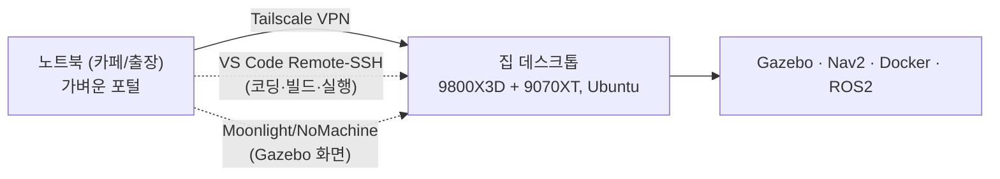

# 개발 서버 세팅 가이드 — 집 데스크톱을 리눅스 개발 서버로

> 상황: 집에 고성능 데스크톱(예: Ryzen 9800X3D + Radeon 9070XT + 32GB, Windows 11 Pro)이 있고, 출장/회사/카페에서는 **가벼운 노트북**으로 작업. 이 문서는 **데스크톱을 리눅스 개발 서버로 만들고, 노트북에서 원격 접속**하는 방법입니다. 무거운 작업(Gazebo·Docker 빌드·ML)은 전부 데스크톱이 처리하고, 노트북은 화면만 받습니다.
>
> _최종 갱신: 2026-07-08 · 문서 버전 v1_

---

## 전체 그림



노트북에서 편집하지만 **빌드·실행은 데스크톱에서** 돌아갑니다. 대역폭을 거의 안 쓰는 SSH 기반이라 느린 와이파이에서도 쾌적합니다.

---

## 0. 데스크톱: 우분투를 어떻게 올릴까 (듀얼부팅 vs WSL2)

| | **듀얼부팅 Ubuntu** ⭐추천 | **WSL2** |
|---|---|---|
| 원격 서버 적합성 | 높음 (표준 sshd, 고정 LAN IP) | 낮음 (NAT라 포트포워딩 필요) |
| Gazebo/9070XT 성능 | 최상 (네이티브 GPU) | 준수 (WSLg) |
| 윈도우 유지 | 재부팅으로 전환 | 그대로 공존 |
| 추천 | **상시 켜두는 개발 서버로 쓸 때** | 윈도우를 자주 쓰고 리눅스는 가볍게 |

원격 개발 서버로 상시 운용할 거면 **듀얼부팅 네이티브 Ubuntu**가 훨씬 깔끔합니다(아래는 이 경로 기준). WSL2 경로는 맨 아래 별도 안내.

> ⚠️ **9070XT(RDNA4) 리눅스 주의**: 최신 커널·Mesa가 필요합니다. **Ubuntu 24.04.2 이상 + HWE 커널**(또는 24.10/25.04)을 쓰고, 설치 전 "RX 9070 XT Ubuntu" 호환 후기를 확인하세요.

---

## 1. 데스크톱에 Ubuntu 듀얼부팅 설치

1. **중요한 데이터 백업** 후, Windows에서 디스크 파티션을 줄여 여유 공간 확보(디스크 관리 → 볼륨 축소, 예: 200GB+).
2. Ubuntu 24.04 LTS ISO를 USB로 구움(Rufus/balenaEtcher). 공식: <https://ubuntu.com/download/desktop>
3. BIOS에서 USB 부팅 → "Install alongside Windows" 선택 → 설치.
4. 부팅 시 GRUB에서 Ubuntu/Windows 선택.
5. 설치 후 그래픽 확인: `sudo apt update && sudo apt install -y mesa-utils && glxinfo | grep "OpenGL renderer"` → 9070XT가 보이면 OK.

## 2. 어디서든 연결 — Tailscale (VPN)

집 공유기 포트포워딩 없이, 안전하게 노트북↔데스크톱을 잇는 가장 쉬운 방법.

**데스크톱(Ubuntu):**
```bash
curl -fsSL https://tailscale.com/install.sh | sh
sudo tailscale up
tailscale ip -4       # 100.x.x.x 형태의 주소 확인 (이걸 노트북에서 씀)
```
**노트북:** <https://tailscale.com/download> 에서 앱 설치 후 **같은 계정**으로 로그인. 끝. 이제 노트북은 어디서든 데스크톱의 `100.x.x.x` 로 접속됩니다.

## 3. 원격 코딩 — SSH + VS Code Remote-SSH

**데스크톱(Ubuntu):**
```bash
sudo apt install -y openssh-server
sudo systemctl enable --now ssh
```
**노트북:** SSH 키를 만들어 데스크톱에 등록(비밀번호 로그인보다 안전):
```bash
ssh-keygen -t ed25519           # 노트북에서 (엔터 계속)
ssh-copy-id <사용자>@100.x.x.x   # 데스크톱 tailscale IP
ssh <사용자>@100.x.x.x           # 접속 테스트
```
**VS Code:** 확장 **Remote - SSH** 설치 → 좌하단 초록 버튼 → `Connect to Host` → `<사용자>@100.x.x.x`. 이제 노트북 화면이지만 **파일·터미널·빌드·실행은 전부 데스크톱**에서 돕니다.

## 4. Gazebo 화면 스트리밍 (필요할 때만)

코딩은 3번으로 끝이고, **3D 시뮬 GUI를 볼 때만** 사용:

- **Moonlight + Sunshine** (저지연, 9070XT 인코딩): 데스크톱에 **Sunshine** 설치(<https://github.com/LizardByte/Sunshine>), 노트북에 **Moonlight** 설치(<https://moonlight-stream.org>). Tailscale IP로 페어링.
- **또는 NoMachine** (<https://www.nomachine.com>): 양쪽 설치만 하면 리눅스 원격 데스크톱이 간단히 됨.

## 5. (선택) 원격으로 데스크톱 켜기 — Wake-on-LAN

상시 전원이 부담되면 WOL로 원격 부팅:
```bash
# 데스크톱: BIOS에서 Wake-on-LAN 활성화 후
sudo apt install -y ethtool && ip link            # 인터페이스명 확인(예: enp5s0)
sudo ethtool -s enp5s0 wol g
```
같은 LAN에서 `wakeonlan <MAC>` 으로 깨울 수 있습니다. (외부에서 깨우려면 집에 상시 켜진 기기 하나가 WOL 신호를 중계해야 함 — 공유기 기능이나 라즈베리파이 등)

## 6. 이 프로젝트를 원격에서 실행

데스크톱에 SSH로 접속한 뒤(또는 VS Code Remote 터미널에서):
```bash
git clone <이-저장소> && cd Robo_Market
git checkout claude/rag-ai-agent-llm-wiki-d4opy6
docker build -f docker/Dockerfile -t robo-copilot .
docker run -it --rm -p 8000:8000 -e ANTHROPIC_API_KEY="sk-ant-..." \
  robo-copilot bash /app/docker/web-demo.sh
```
그다음 **노트북 브라우저**에서 `http://100.x.x.x:8000` (데스크톱 Tailscale IP) 접속 → 웹 챗이 열립니다. Gazebo 시뮬(`sim.launch.py`)은 데스크톱에서 돌리고 화면만 4번으로 받으면 됩니다.

---

## 보안 3원칙
1. **SSH는 키만 허용** — `/etc/ssh/sshd_config` 에서 `PasswordAuthentication no` 후 `sudo systemctl restart ssh`.
2. **공유기 포트포워딩 하지 말 것** — Tailscale이 알아서 안전하게 뚫습니다. 8000 포트를 인터넷에 직접 열지 마세요.
3. **Tailscale ACL**로 접근을 본인 기기로만 제한(기본값도 안전).

---

## WSL2 경로 (윈도우를 유지하고 싶다면)
1. 관리자 PowerShell: `wsl --install -d Ubuntu-24.04` → 재부팅.
2. **Sunshine를 Windows에 설치**하면 WSLg의 Gazebo 창까지 포함해 **윈도우 화면 전체**를 노트북 Moonlight로 스트리밍할 수 있습니다.
3. 원격 SSH는 **Windows용 OpenSSH 서버**를 켜고 접속 후 `wsl` 로 진입하는 방식이 가장 간단합니다(WSL2 내부 sshd는 NAT라 포트프록시가 필요해 번거로움).
4. Tailscale은 **Windows에 설치**(WSL2는 호스트 네트워크를 공유).

> WSL2는 설치가 쉽지만 원격 접속·USB 로봇 하드웨어에서 잔손질이 늘어납니다. **상시 개발 서버**로는 듀얼부팅 네이티브를 권장합니다.

---

## 갱신 이력
- **v1 (2026-07-08)**: 최초 작성. 듀얼부팅/WSL2, Tailscale, VS Code Remote-SSH, Moonlight/NoMachine, WOL, 프로젝트 원격 실행.
