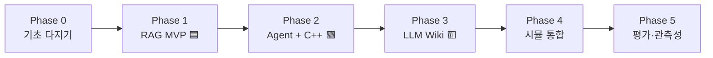

# 로드맵 (ROADMAP)

**어떤 순서로 만들고, 각 단계에서 무엇을 배우는가.** 각 Phase는 "완료 기준(Done when)"을 가진다 — 애매하게 넘어가지 말고 기준을 채우고 다음으로.

> 원칙: **작동하는 결과를 빨리, 자주.** 무거운 시뮬(Gazebo)은 뒤로 미루고, RAG처럼 로봇 없이 되는 것부터 손에 잡히는 산출물을 만든다.

---

## 전체 그림

| Phase | 핵심 산출물 | 주 언어 | 예상 기간(주말 기준) |
|---|---|---|---|
| 0 | 개발 환경 + "hello ROS2" + LLM 첫 호출 | Py/C++ | 1주 |
| 1 | RAG로 ROS2 문서 Q&A (CLI) | Python | 2주 |
| 2 | 자연어 → 로봇 이동 에이전트 (C++ 실행 노드 포함) | **C++ + Python** | 3주 |
| 3 | ROS2 그래프 자동 문서화 | Python | 1~2주 |
| 4 | Gazebo + Nav2 위에서 end-to-end 데모 | 통합 | 2~3주 |
| 5 | RAG 정확도 · 에이전트 성공률 평가 | Python | 1~2주 |

---

## Phase 0 — 기초 다지기

**목표:** 이후 모든 단계의 토대. 여기서 막히면 진도가 안 나간다.

- [ ] ROS2(Humble 또는 Jazzy) + colcon 개발 환경 구축 (Ubuntu 22.04/24.04 또는 Docker)
- [ ] **rclpy 노드 1개** (publisher) + **rclcpp 노드 1개** (subscriber) 작성해 서로 통신
- [ ] 커스텀 인터페이스 패키지 `copilot_msgs` 생성 (`.srv` 하나 정의 → C++/Python 양쪽에서 빌드)
- [ ] Claude API 첫 호출 (Python SDK) — 간단한 프롬프트 응답 받기
- [ ] `ANTHROPIC_API_KEY` 환경변수 세팅, `.gitignore`에 키/빌드 산출물 등록

**✅ Done when:** `colcon build` 성공 + C++⇄Python 노드가 커스텀 메시지로 통신 + 터미널에서 Claude 응답 확인.

**배우는 것:** colcon 워크스페이스, ament(python/cmake), 노드/토픽 기본, 커스텀 인터페이스, LLM API 기초.

---

## Phase 1 — RAG MVP 🟦 (`copilot_rag`)

**목표:** 로봇 없이 되는 것부터. "ROS2 문서에게 질문하기".

- [ ] 문서 수집: ROS2/Nav2 문서 일부 + 이 워크스페이스 소스/YAML
- [ ] 청킹 → 임베딩 → 벡터DB 저장 파이프라인 (Chroma로 시작, 나중에 pgvector)
- [ ] 검색 → 프롬프트 조립 → Claude 답변 + **출처 인용** (핵심: 근거 없는 답 금지)
- [ ] rclpy 서비스 노드 `~/query`로 래핑 → `ros2 service call`로 질문
- [ ] (선택) 간단한 리랭킹 추가해 검색 품질 비교

**✅ Done when:** `ros2 service call /copilot_rag/query ...` 로 질문 시, 출처가 달린 정확한 답이 온다. 출처에 없는 내용은 "모른다"고 답한다.

**배우는 것 — AI:** 청킹 전략, 임베딩, 벡터 검색, 리랭킹, citation, 할루시네이션 억제. **로봇/개발:** rclpy 서비스 서버, 파라미터, 패키지 구조.

---

## Phase 2 — AI Agent + C++ 실행 노드 🟩 (`copilot_agent` + `copilot_executor`)

**목표:** 자연어 명령을 계획하고 **로봇을 움직인다.** C++/Python 균형이 실현되는 단계.

- [ ] **Python 두뇌** (`copilot_agent`): Claude tool calling으로 도구 선택 (ReAct 루프)
- [ ] 도구 구현: `query_knowledge`, `get_robot_state`(tf2/odom), `list_topics`/`node_info`(graph API)
- [ ] **C++ 실행 노드** (`copilot_executor`): `ExecuteCommand` 액션 서버 (rclcpp)
  - [ ] 안전 검증 로직 (맵 범위, 속도 한계, e-stop)
  - [ ] Nav2 `NavigateToPose`로 위임 + 피드백 스트리밍
- [ ] **C++ Safety Monitor 노드**: `/scan` 기반 긴급 정지, e-stop 발행
- [ ] 통합: "앞으로 2m 가" 같은 명령이 Agent→Executor→(가짜 Nav2 or Phase4 실물)로 흐름

> Phase 4 전이라 진짜 Nav2가 없다면, Executor가 목표를 로깅/모의 이동하는 **stub**으로 먼저 검증 → Phase 4에서 실 Nav2 연결.

**✅ Done when:** 자연어 명령이 Agent의 도구 호출로 변환되고, C++ Executor가 안전 검증을 거쳐 실행(또는 모의 실행)하며, Safety Monitor가 위험 시 정지시킨다.

**배우는 것 — AI:** tool calling, 에이전트 루프, 멀티스텝 추론, 도구 설계. **로봇/개발:** **rclcpp 액션 서버**, tf2, QoS, 안전 설계, C++⇄Python 협업.

---

## Phase 3 — LLM Wiki 🟨 (`copilot_wiki`)

**목표:** 만들어 놓은 시스템을 자동으로 문서화.

- [ ] rclpy graph API로 노드/토픽/서비스/파라미터 introspection
- [ ] 소스 파싱으로 노드 목적/주석 추출
- [ ] Claude로 노드별 위키 페이지 생성 (**introspection 사실만 서술**하도록 grounding)
- [ ] mermaid 메시지 흐름도 자동 생성 + 페이지 간 크로스링크
- [ ] `docs/generated/`에 출력, 재실행 시 갱신

**✅ Done when:** 명령 한 번으로 현재 시스템의 노드 위키가 생성되고, 없는 토픽을 지어내지 않는다.

**배우는 것 — AI:** structured generation, grounding, 요약. **로봇/개발:** ROS2 introspection API, 그래프 분석.

---

## Phase 4 — 시뮬레이션 통합

**목표:** 진짜 로봇 위에서 end-to-end. 포트폴리오 데모 영상이 여기서 나온다.

- [ ] `copilot_bringup`: Gazebo에 모바일 로봇(TurtleBot3 등) + Nav2 스택 런치
- [ ] Executor를 실제 Nav2 `NavigateToPose`에 연결
- [ ] 시나리오: "A 지점으로 가서 뭐가 보이는지 알려줘" → 이동 + 센서 조회 + 자연어 보고
- [ ] Safety Monitor를 실 `/scan`에 연결해 장애물 정지 검증
- [ ] **데모 영상 녹화** (RViz + 터미널 대화)

**✅ Done when:** 시뮬 로봇이 자연어 명령으로 목표까지 안전하게 이동하고 상태를 보고한다.

**배우는 것:** Gazebo, Nav2 설정(costmap, planner, controller), launch 시스템, RViz, tf 트리 디버깅.

---

## Phase 5 — 평가 · 관측성

**목표:** "잘 된다"를 **숫자로** 증명. 시니어 개발자다운 마무리.

- [ ] RAG 평가셋: 질문-정답-근거 쌍 → 정확도 & citation 정확도 측정
- [ ] 에이전트 평가: 명령별 성공률, 도구 호출 정확도, 안전 위반 0건 확인
- [ ] LLM 호출/도구 실행 로깅·트레이싱 (지연·비용 포함)
- [ ] README에 결과 표 + 데모 GIF 추가

**✅ Done when:** RAG/에이전트 성능이 표로 정리되고, 회귀 시 잡아낼 평가 스크립트가 있다.

**배우는 것:** LLM 평가 방법론, eval harness, 관측성, 회귀 테스트.

---

## 진행 팁

- **Phase마다 커밋·PR·데모.** 각 단계 산출물이 포트폴리오 조각이다.
- **막히면 범위를 줄여라.** Nav2가 버거우면 `cmd_vel` 직접 발행으로 단순화 → 나중에 Nav2.
- **문서를 코드와 함께.** 각 Phase 후 `docs/`에 배운 점 기록 → 이게 곧 "학습 가이드"이자 블로그 소재.
- 각 기술을 처음부터 깊게 파려면 [학습 가이드](LEARNING_GUIDE.md)의 자료를 함께 보세요.
